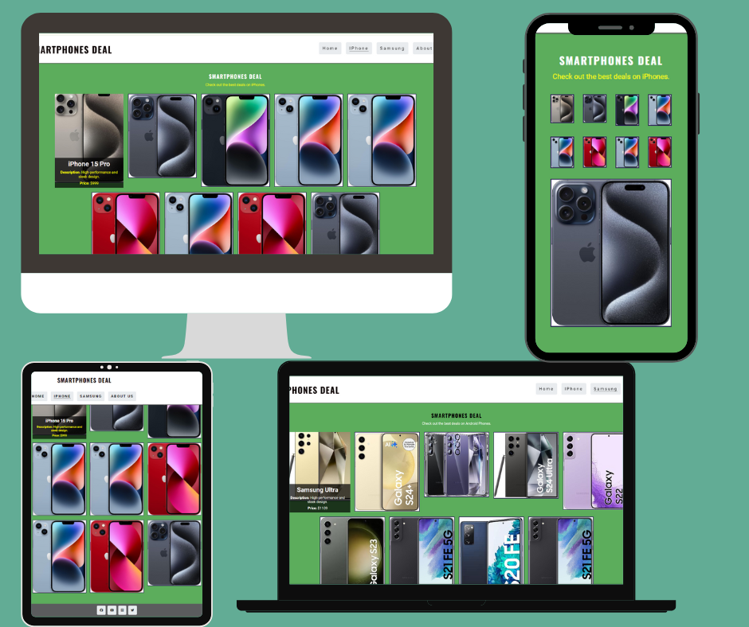
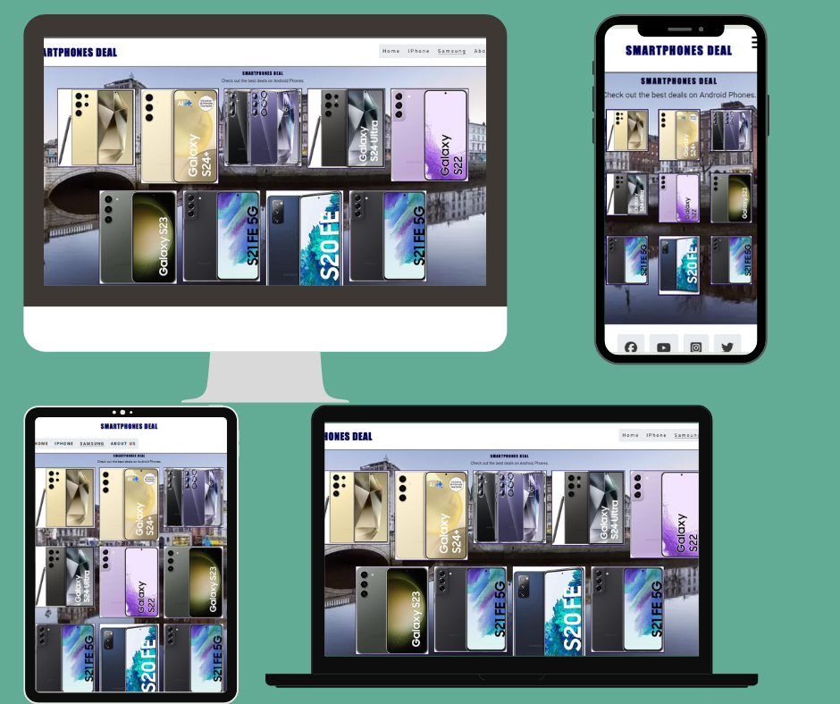
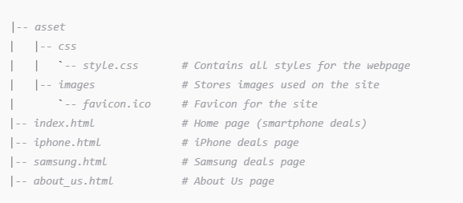

# Smart-phone
Smartphones Deal

Project Overview

This project is a website designed to provide the best deals on the latest smartphones. It features exclusive offers and discounts on top brands like Apple, Samsung, and more. The website is user-friendly and provides detailed information about various smartphone deals. 

Table of Contents
### CONTENTS

* [Design](#design)
  * [Colour Scheme](#colour-scheme)
  * [Typography](#typography)
  * [Imagery](#imagery)
  * [Features](#features)
    * [The Home Page](#the-home-page)
    * [The Iphone Page](#the-game-page)
    * [The Samsung Page](#the-samsung-page)
    * [The About page](#the-about-us-page)
    * [Future Implementations](#future-implementations)
  * [Accessibility](#accessibility)
* [Technologies Used](#technologies-used)
  * [Languages Used](#languages-used)
  * [Frameworks, Libraries & Programs Used](#frameworks-libraries--programs-used)

* [Deployment & Local Development](#deployment--local-development)
  * [Deployment](#deployment)
  * [Local Development](#local-development)
    * [How to Fork](#how-to-fork)
    * [How to Clone](#how-to-clone)
*[validation](#for-html-and-css)
* [Testing](#testing)
  * [Solved Bugs](#solved-bugs)
  * [Known Bugs](#known-bugs)
  
* [Credits](#credits)
  * [Code Used](#code-used)
  * [Content](#content)
  * [Media](#media)
  * [Acknowledgments](#acknowledgments)
 
  ### Design

### Colour Scheme

As the pages of the site have a background image, I wanted to keep the colour scheme used on the site quite small so as to not overwhelm users.

* I have used `##ffffff` & `##000000` as the primary and 
   secondary colours used for the sites text.
*   I have used `##` as the overlay used over the sites 
    background image. 
*   I have used ##3a3a3a for borders
*   I have used for pargraph ##f7f7f7 and #4CAF50
*  I have used `##rgba(0, 0, 0, 0.1)` as the box shadow 
  container section.

### Typography

* Google Fonts was used to import the chosen fonts for use in 
  the site.
* For the body of the page I have used the google font [Roboto]('https://fonts.googleapis.com/css2family=Roboto:ital,wght@0,100;0,300;0,400;0,500;0,700;0,900;1,100;1,300;1,400;1,500;1,700;1,900&display=swap');
* Roboto is a sans-serif font which has lovely clean lines. I 
 have chosen to use a sans-serif font for the body of the page 
 as studies have found that sans-serif fonts are generally more legible to read on a screen.

 ### Features
* Responsive design for optimal viewing on different devices.
* Navigation menu for easy access to different sections.
* Contact form for user feedback.
* Social media links for better connectivity.

#### The Home Page
Content
Home Page (index.html)

Smartphones Deal Webpage

This project is a fully responsive webpage designed to showcase the latest deals on smartphones, including brands like Apple and Samsung. The site offers a clean and professional design with structured content sections highlighting exclusive deals, featured promotions, and limited-time offers. It is ideal for a mobile phone retail business aiming to promote its offerings to a wide range of customers.

### Features

1. Responsive Navigation Bar
* The header includes a logo and a navigation menu with links 
  to different sections such as Home, iPhone, Samsung, and 
   About Us.
* A hamburger-style menu appears on smaller screens for mobile- 
  friendliness, providing a seamless browsing experience across 
  all devices.
2. SEO and Metadata
* Meta tags for description and keywords are included to 
 optimize the page for search engines, improving 
 discoverability.
* Keywords such as "smartphone deals," "best smartphone 
  offers," and "mobile phone sales" target customers looking 
  for great deals on mobile phones.
3. Favicon and Web Manifest
* The page includes a favicon for brand recognition on various 
  devices and platforms.
* A web manifest is integrated, allowing the webpage to act as 
  a Progressive Web App (PWA) on supported browsers, providing 
  users with an app-like experience when installed on their 
  devices.
4. Content Sections
* Welcome Section: Provides an introductory message and 
  outlines the key benefits of shopping with the store, 
  including exclusive offers, top brands, and fast shipping.
* Featured Deals: Highlights limited-time promotions, such as 
  savings on iPhone 14 Pro Max and a free pair of Galaxy Buds 
  with the purchase of a Samsung Galaxy S23 Ultra.
* Limited-Time Offers: Displays exciting promotions like buy- 
  one-get-one-free deals, trade-in programs, and flexible 
  monthly payment plans.
5. User-Centered Design
* Mobile-Friendly: The site is fully responsive, ensuring a 
  smooth user experience on all devices, including desktops, 
  tablets, and smartphones.
* Fast Loading: The design prioritizes speed and efficiency, offering fast loading times to enhance user experience.
6. Social Media Integration
* Social media icons are integrated into the footer, allowing 
  users to connect with the business on platforms like 
  Facebook, YouTube, Instagram, and Twitter. Each icon is 
  represented using Font Awesome for consistency and 
  accessibility.
* Links open in new tabs for uninterrupted browsing.
  
  
### Brand Pages
### IPhone Page (iphone.html)

[iphone page](https://github.com/GetanehT/Smart-phone/blob/main/asset/images/iphonepg.png)

### Overview
The iPhone page focuses specifically on deals and offers related to Apple's iPhone models.

### Features

1. Responsive Navigation Menu
   
* The header contains a navigation bar with links to various 
 sections of the site, such as Home, iPhone, Samsung, and About 
 Us.
* A hamburger menu icon appears on smaller screen sizes for 
 improved mobile navigation.

2. Search Engine Optimization (SEO)
* Meta tags (description and keywords) are added to optimize 
  the page for search engines, targeting keywords like "iPhone 
  deals," "smartphone offers," and "mobile phone sales."
* The webpage is optimized for search engines to improve 
   visibility.
3. iPhone Deals Section
* A dedicated section to highlight the latest deals on various 
  iPhone models.
* Each product is accompanied by high-quality images, detailed 
  descriptions, and prices, ensuring that users can easily 
  browse through the options.
* Featured models include iPhone 15 Pro, iPhone 15 Pro Max, 
  iPhone 14, and more.
4. Image Gallery
* A clean and user-friendly gallery showcasing different iPhone 
  models.
* Each image is paired with a product name, a brief 
  description, and its price.
* This layout ensures that users can quickly find the product 
  that suits their needs.
5. Social Media Integration
* Social media icons are placed in the footer section, linking 
  to the brand's Facebook, YouTube, Instagram, and Twitter 
   pages.
* These links open in a new tab for convenience and are 
   accessible via Font Awesome icons.
* Fully responsive icons improve the site's interactivity and 
  engagement.
6. Mobile-Friendly Design
* The webpage is responsive, offering an optimal user 
   experience across desktops, tablets, and mobile devices.
* CSS and viewport meta tags are used to ensure that the page 
  scales well on different devices, ensuring a great browsing 
  experience.
  
  ### Samsung page (samsung.html)

[samsung page](https://github.com/GetanehT/Smart-phone/blob/main/asset/images/sampg.png)

### Overview

The Samsung page focuses specifically on deals and offers related to Samsung Phone models.
FeaturesFeatures
1. Responsive Navigation Menu
* A responsive navigation bar with links to various sections of 
  the site, including Home, iPhone, Samsung, and About Us.
* Hamburger icon for mobile-friendly navigation.
2. SEO Optimizations
* Metadata (description and keywords) added to improve search 
  engine rankings for smartphone deals.
* Optimized for keywords like "smartphone deals," "Samsung," 
   and "mobile phone sales."
3. Smartphone Deals Section
*  A dedicated section showcasing various Samsung models with 
   images, descriptions, and prices.
*  Each phone model has an accompanying description detailing 
   its features and price.
*  Models featured include Samsung Ultra, Galaxy S24, Samsung 
    23, and others.
   
4. Image Gallery
*  An image gallery displaying multiple Samsung smartphone 
   models with their respective descriptions and prices.
*  User-friendly layout that allows users to view different 
   phones easily.
   
5. Social Media Links
*  Social media links (Facebook, YouTube, Instagram, and 
   Twitter) are integrated into the footer.
*  Each link opens in a new tab and is accompanied by an 
   appropriate Font Awesome icon for better user experience.
   
6. Footer Section
* The footer contains social media links, making it easy for 
  users to connect with the brand on various platforms.
* Fully responsive and visually appealing icons powered by Font 
  Awesome.
7. Mobile-Friendly Design
* The webpage is responsive and designed to look great on all 
   devices, including desktops, tablets, and smartphones.
*  Utilizes meta viewport tags and CSS to ensure a seamless 
  user experience on all screen sizes.

 ### About us page (about_us.html)

[About-us page](https://github.com/GetanehT/Smart-phone/blob/main/asset/images/abtpg.png)

### Overview
The About us  page focuses specifically on gives us customers feedback form and gives contact information and working hours and addres.
Features
*	Responsive Navigation Menu
* A responsive navigation bar that allows users to navigate to 
  different pages (Home, iPhone, Samsung, About Us) on the site.
* Includes a mobile-friendly menu that toggles open/close using 
  a checkbox and a hamburger icon.
*	Main Content: A feedback form that allows users to provide their first name, last name, email address, and feedback.
* Includes a textarea where users can describe how the website can improve their experience.
* Form submission handled via a POST request to an external service (https://formdump.codeinstitute.net).
  
### Contact Information
* A detailed contact section providing business hours (opening/closing times), phone number, email, and physical address.
* Displays information in a user-friendly table format.
  
	### Social Media Links

* Links to various social media platforms (Facebook, YouTube, 
  Instagram, Twitter) with icons.
* External links are designed to open in a new tab for a smooth 
  user experience.
  
  ### Font Awesome Integration
  
* Includes Font Awesome icons for the social media links and feedback form (like the heartbeat icon) to enhance the visual appeal.
* 
  ###  Mobile-Friendly Design
  
* Fully responsive design for optimal viewing on various screen 
 sizes, including mobile, tablet, and desktop.
* Utilizes meta viewport tags and CSS to ensure a user-friendly experience across devices.
  
### Future Implementations 

* As part of continuous improvement and feature enhancement, several functionalities and optimizations can be added to this smartphone deal website to further elevate user experience, business efficiency, and overall site performance. Here is a roadmap for future implementations:
  
1. E-Commerce Integration
* Shopping Cart and Checkout System: Implement a full e- 
  commerce solution that includes a shopping cart, order 
  summary, and secure checkout using payment gateways like 
  PayPal, Stripe, or Square.
* Product Filtering and Search: Allow users to filter products 
  by price, brand, and other features such as camera quality, 
  storage, and color options.
* Wishlist Functionality: Enable users to create wishlists for 
  saving products they are interested in, encouraging future 
  purchases.

 ### File Structure

### Technologies Used

* HTML5 : The core structure of the webpage.
* CSS3:Used for styling and layout, ensuring the site             looks modern and professional.
* Font: For icons in the navigation bar and footer         
  sections.
* Web Manifest: For enabling Progressive Web App functionality.
  
### Installation

Deployment & Local Development

### Deployment

* The site is deployed using GitHub Pages 
    [smart-phone](https://getaneht.github.io/Smart-phone/)
To Deploy the site using GitHub Pages:
1.Login (or signup) to Github.
2.Go to the repository for this project, [Getaneht/Smart- 
  phone]https://getaneht.github.io/Smart-phone/
3.Click the settings button.
4.Select pages in the left hand navigation menu.
5.From the source dropdown select main branch and press save.
6.The site has now been deployed, please note that this process 
  may take a few minutes before the site goes live.

### Local Development

### How to Fork

To fork the repository:

1. Log in (or sign up) to Github.
2. Go to the repository for this project,[Smart-phone] 
   (https://github.com/GetanehT/Smart-phone) 
3. Click the Fork button in the top right corner.
   
### How to Clone

To clone the repository:

1. Log in (or sign up) to GitHub.
2. Go to the repository for this project, [GetanehT/Smart-phonr](https://github.com/GetanehT/Smart-phone)
3. Click on the code button, select whether you would like to 
   clone with HTTPS, SSH or GitHub CLI and copy the link shown.
4. Open the terminal in your code editor and change the current 
   working directory to the location you want to use for the 
   cloned directory.
5.Type 'git clone' into the terminal and then paste the link you copied in step 3. Press enter.

### Usage

* Navigate through the website using the menu links to explore 
 different sections. You can view the deals on iPhones and 
 Samsung smartphones, provide feedback through the feedback 
 form, and get in touch via the contact section.

### Validation

* I use   W3C Markup Validation Service validation website to 
   check for errors  (https://validator.w3.org/nu/#textarea)
* no error or warning for all pages 

  
  
* for i phone.html

  
   

* for samsung.html
  
 
   ![validation-samsung.html] https://github.com/GetanehT/Smart-phone/blob/main/asset/images/samvpg.png

### Testing

To ensure that all features of the website are functioning correctly, follow these testing steps:

1.	Responsive Design Testing
o	Open the website in different browsers (Chrome, Firefox, Safari, Edge).
o	Resize the browser window to check how the layout adapts to different screen sizes.
o	Test on various devices (desktop, tablet, smartphone).
2.	Form Testing
o	Navigate to the feedback form.
o	Fill in all fields with valid data and submit the form to ensure it processes correctly.
o	Try submitting the form with invalid data (e.g., incorrect email format) to check validation.
3.	Navigation Testing
o	Click on each navigation link to ensure they redirect to the correct pages.
o	Check if the active page is highlighted in the navigation menu.
4.	Content Testing
o	Review all text for typos and grammatical errors.
o	Ensure all images load correctly.
o	Verify all links (internal and external) work properly.
5.	Google Maps Integration
o	Verify that the map loads correctly and points to the correct location.
6.	Social Media Links
o	Click on each social media icon to ensure it opens the correct platform in a new tab.

### Common Sections Across All Pages

Header

* Logo: Links to the home page.
* Navigation Menu: Links to the Home, iPhone, Samsung, and 
About 
  Us pages.

Feedback Section

* Feedback Form: Collects user feedback, including fields for 
  first name, last name, email address, and feedback comments.
  Contact Informatio
* Open Times: Table showing the store's operating hours.
* Contact Details: Phone number and email address for customer 
  inquiries.
* Physical Address: Store location address.

Footer
* Social Media Links: Icons linking to the store's profiles on Facebook, YouTube, Instagram, and Twitter.

### Contributing

* Contributions are welcome! Please follow these steps:
1. Fork the repository.
   
2.Create a new branch:
     git checkout -b feature-branch
     
3.Make your changes and commit them:
   git commit -m "Add new feature"
   
4.Push to the branch:
  git push origin feature-branch
  
5.Open a pull request.

