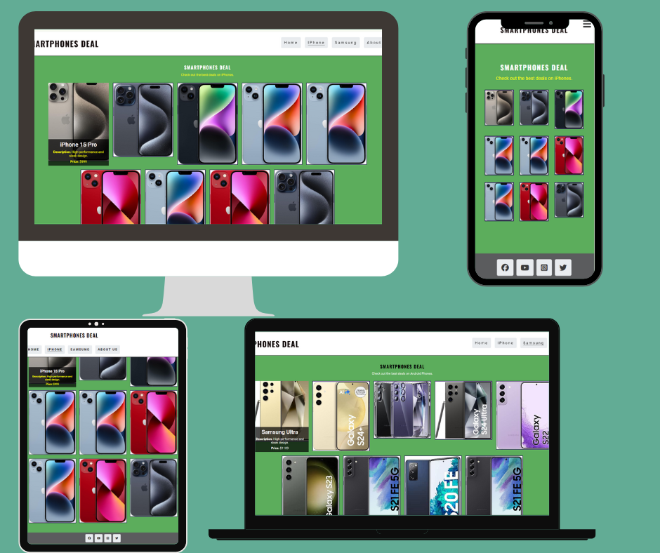

# Smart-phone
Smartphones Deal

Project Overview
This project is a website designed to provide the best deals on the latest smartphones. It features exclusive offers and discounts on top brands like Apple, Samsung, and more. The website is user-friendly and provides detailed information about various smartphone deals.
Table of Contents
## CONTENTS

* [Design](#design)
  * [Colour Scheme](#colour-scheme)
  * [Typography](#typography)
  * [Imagery](#imagery)
  * [Features](#features)
    * [The Home Page](#the-home-page)
    * [The Iphone Page](#the-game-page)
    * [The Samsung Page](#the-samsung-page)
    * [The 404 Error Page](#the-404-error-page)
    * [Future Implementations](#future-implementations)
  * [Accessibility](#accessibility)

* [Technologies Used](#technologies-used)
  * [Languages Used](#languages-used)
  * [Frameworks, Libraries & Programs Used](#frameworks-libraries--programs-used)

* [Deployment & Local Development](#deployment--local-development)
  * [Deployment](#deployment)
  * [Local Development](#local-development)
    * [How to Fork](#how-to-fork)
    * [How to Clone](#how-to-clone)

* [Testing](#testing)
  * [Solved Bugs](#solved-bugs)
  * [Known Bugs](#known-bugs)
  
* [Credits](#credits)
  * [Code Used](#code-used)
  * [Content](#content)
  * [Media](#media)
  * [Acknowledgments](#acknowledgments)
 
  ## Design

### Colour Scheme

As the pages of the site have a background image, I wanted to keep the colour scheme used on the site quite small so as to not overwhelm users.

* I have used `#ffffff` & `##000000` as the primary and secondary colours used for the sites text.
* I have used `##5b5c5e` as the overlay used over the sites background image.

### Typography

Google Fonts was used to import the chosen fonts for use in the site.

 ### Features
*	Responsive design for optimal viewing on different devices.
*	Navigation menu for easy access to different sections.
*	Contact form for user feedback.
* Social media links for better connectivity.

#### The Home Page
Content
Home Page (index.html)
Overview
The Home page serves as the main landing page for visitors. It provides an overview of the best deals on the latest smartphones, highlighting exclusive offers and discounts on top brands like Apple and Samsung.

Features
*	Header: Contains the site logo and navigation menu.
*	Main Content: This section includes an introduction to the website and highlights current deals and promotions.
*	Feedback Section: Allows users to provide feedback through a form.
*	Contact Information: Lists the store's open times, contact phone number, email address, and physical address.
*	Google Maps: An embedded map showing the store's location.
*	Footer: Contains links to social media profiles.
  
### Brand Pages
### IPhone Page (iphone.html)

Overview
The iPhone page focuses specifically on deals and offers related to Apple's iPhone models.
Features
*	Header: Same as the home page, with site logo and navigation menu.
*	Main Content: Showcases various iPhone   models available for 
  sale, including prices, discounts, and detailed descriptions.
*	Feedback Section: Similar feedback form as on the home page.
*	Contact Information: Same contact details as on the home page.
*	Footer: Same as the home page, with social media links.
*	Footer: Same as the home page, with social media links.

  ### IPhone Page (iphone.html)

Overview
The iPhone page focuses specifically on deals and offers related to Apple's iPhone models.
Features
*	Header: Same as the home page, with site logo and navigation menu.
*	Main Content: Showcases various iPhone models available for 
  sale, including prices, discounts, and detailed descriptions.
*	Feedback Section: Similar feedback form as on the home page.
*	Contact Information: Same contact details as on the home page.
*	Footer: Same as the home page, with social media links.
*	Footer: Same as the home page, with social media links.

### Technologies Used
*	HTML5
*	CSS3
*	Font Awesome for icons
*	Google Maps Embed API
  
### Installation
Deployment & Local Development
### Deployment
* The site is deployed using GitHub Pages  (https://github.com/GetanehT/Smart-phone)
To Deploy the site using GitHub Pages:
1.	Login (or signup) to Github.
2.	Go to the repository for this project, https://getaneht.github.io/Smart-phone/
3.	Click the settings button.
4.	Select pages in the left hand navigation menu.
5.	From the source dropdown select main branch and press save.
6.	The site has now been deployed, please note that this process may take a few minutes before the site goes live.

### Local Development

### How to Fork

To fork the repository:

1.	Log in (or sign up) to Github.
2.	Go to the repository for this project,  
3.	Click the Fork button in the top right corner.
   
### How to Clone

To clone the repository:

1.	Log in (or sign up) to GitHub.
2.	Go to the repository for this project, kera-cudmore/TheQuizArms
3.	Click on the code button, select whether you would like to clone with HTTPS, SSH or GitHub CLI and copy the link shown.
4.	Open the terminal in your code editor and change the current working directory to the location you want to use for the cloned directory.
5.	Type 'git clone' into the terminal and then paste the link you copied in step 3. Press enter.
Usage
Navigate through the website using the menu links to explore different sections. You can view the deals on iPhones and Samsung smartphones, provide feedback through the feedback form, and get in touch via the contact section.                                                                                                                                                                             
### About Us Page (aboutus.html)
Overview
The About Us page provides information about the company, its mission, and its team.

Features

*	Header: Same as the home page, with site logo and navigation menu.
*	Main Content: Includes a detailed description of the company's background, mission statement, and information about the team members.

*	Feedback Form
Users can provide their feedback through the form, which includes fields for first name, last name, email address, and their comments.
*	Contact Information
Provides details on open times, contact phone number, email address, and the physical address of the store.
*	Footer: Same as the home page, with social media links.

 
### Testing

To ensure that all features of the website are functioning correctly, follow these testing steps:

1.	Responsive Design Testing
o	Open the website in different browsers (Chrome, Firefox, Safari, Edge).
o	Resize the browser window to check how the layout adapts to different screen sizes.
o	Test on various devices (desktop, tablet, smartphone).
2.	Form Testing
o	Navigate to the feedback form.
o	Fill in all fields with valid data and submit the form to ensure it processes correctly.
o	Try submitting the form with invalid data (e.g., incorrect email format) to check validation.
3.	Navigation Testing
o	Click on each navigation link to ensure they redirect to the correct pages.
o	Check if the active page is highlighted in the navigation menu.
4.	Content Testing
o	Review all text for typos and grammatical errors.
o	Ensure all images load correctly.
o	Verify all links (internal and external) work properly.
5.	Google Maps Integration
o	Verify that the map loads correctly and points to the correct location.
6.	Social Media Links
o	Click on each social media icon to ensure it opens the correct platform in a new tab.
Common Sections Across All Pages
Header
•	Logo: Links to the home page.
•	Navigation Menu: Links to the Home, iPhone, Samsung, and About Us pages.
Feedback Section
•	Feedback Form: Collects user feedback, including fields for first name, last name, email address, and feedback comments.
Contact Information
•	Open Times: Table showing the store's operating hours.
•	Contact Details: Phone number and email address for customer inquiries.
•	Physical Address: Store location address.
Footer
•	Social Media Links: Icons linking to the store's profiles on Facebook, YouTube, Instagram, and Twitter.

Contributing
Contributions are welcome! Please follow these steps:
1.	Fork the repository.
2.	Create a new branch:
bash
Copy code
git checkout -b feature-branch
3.	Make your changes and commit them:
bash
Copy code
git commit -m "Add new feature"
4.	Push to the branch:
bash
Copy code
git push origin feature-branch
5.	Open a pull request.

